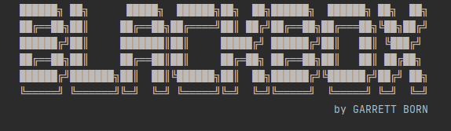
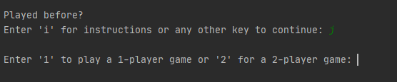
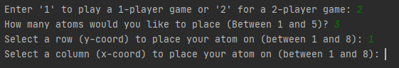
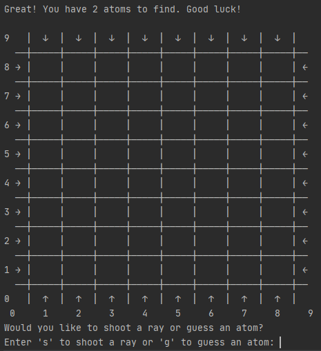

Created in the 1970s, Blackbox is a board game that can be played by one or two players. This program allows the user to play either a 1-player game or a 2-player game via the console.

## Game Rules

The objective is for the guessing player to find atoms hidden in an 8x8 grid by shooting rays from the outside border spaces. 
Each ray's trajectory follows the path of the arrow that marks the border space it originates from. If the rays path intersects an atom directly,
it will hit it and not exit the board. If the ray's path is not obstructed, it will continue on its trajectory until exiting the board. 
If the ray encounters an atom to its front diagonal, it will be deflected at a 90 degree angle in the direction opposite of the atom.

Each entrance and exit is marked after being shot in ascending order starting with '1'. Using the marked entrance and exit location, 
the guessing player can then guess the coordinates of each atom (up to 5 atoms can be placed on the board). The guessing player start with a score of 25. 
For each border space crossed by a ray, 1 point is deducted from that score. For each incorrect guess of an atom, 5 points are deducted. 
The game is won when the guessing player has guessed all of the atoms on the board. The guessing player loses when their score drops to or below 0.

If playing a 1-player game, the atoms are placed randomly for the player to find. For a 2-player game, one player will choose locations to hide the atoms, 
while the other player will have to guess their locations.

## Setting Up a Game

To play a game, select and run `main.py`.

The console will then present the game's title and ask if you would like to view the game's instructions or proceed with playing. 
You will then be prompted to select whether you would like to play a 1-player game or a 2-player game.

If playing a 1-player game, the atoms are placed randomly for the player to find. For a 2-player game, one player will choose locations to hide the atoms, 
while the other player will have to guess their locations.

Once this selection is made, the game will begin.

## Placing Atoms (2-Player Only)

If playing a 2-Player game, the game will start by asking one player to place the atoms. The player will first need to enter how many atoms they would like to place, between 1 and 5.

For each, the player must choose a row (y-coord) and a column (x-coord) for each atom to place them. Once all atoms are placed, the game will begin for the guessing player.

## Playing Blackbox

Once the game begins, the player is first greeted by the game board. Border spaces to fire rays from are identified with arrows that show the initial direction of their trajectory.
The rows are numerated on the left border of the game board, and the columns are numerated at the bottom.

The guessing player is then prompted to choose whether they would like to fire a ray or guess the location of an atom. 

If the player chooses to shoot a ray, they are asked to enter the row of the border space from which they'd like to fire from and then the column space.
Once fired, the start location of the ray will be marked with a character of the alphabet, starting with "A" for the first ray and continuing through the alphabet for each successive ray.

If the player chooses to guess an atom, they are asked to enter the row and then the column of the space for which they believe an atom to be located. 
For correct guesses, the space will be marked with an "A". For incorrect guesses, the space will be marked with an "X".

After each turn, the board will be updated to reflect any changes to the game board resulting from the player's actions. 
The score and number of atoms remaining will also be printed.

If the player guesses all of the atoms correctly, the game will end with them being congratulated for winning. Otherwise,
if the score reaches or passes below zero, the game will end with the guessing player being declared a loser.

---

Enjoy playing Blackbox!
